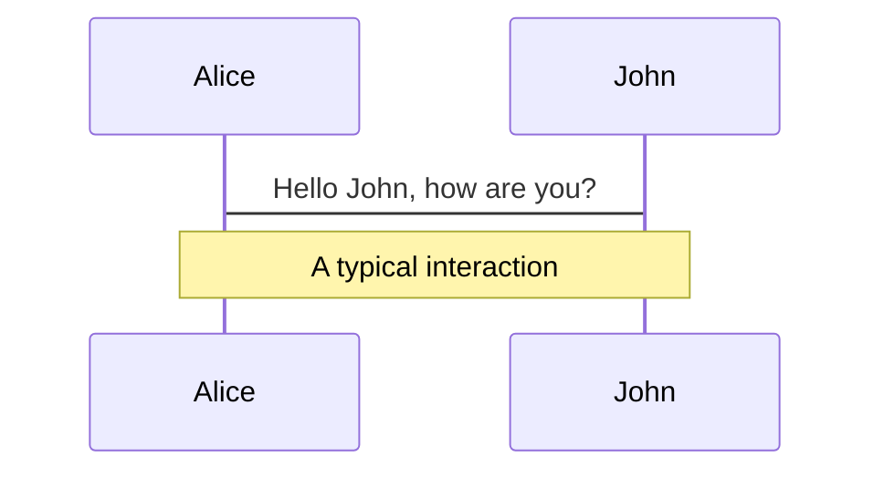
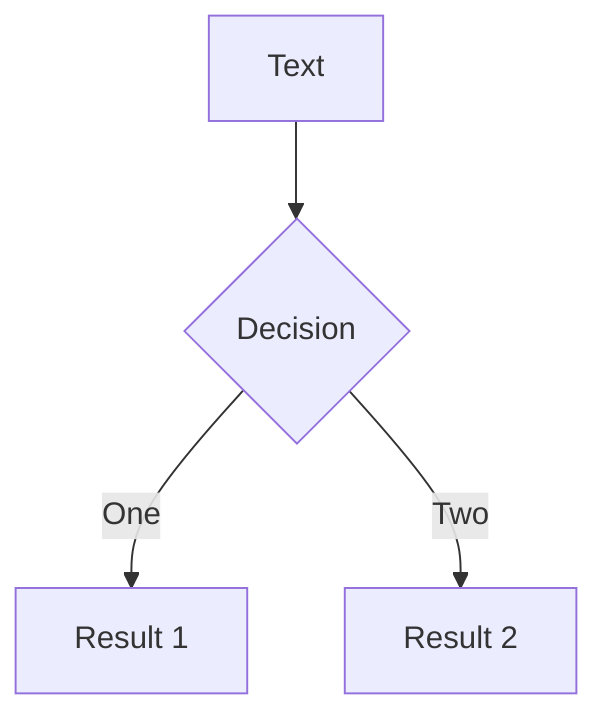
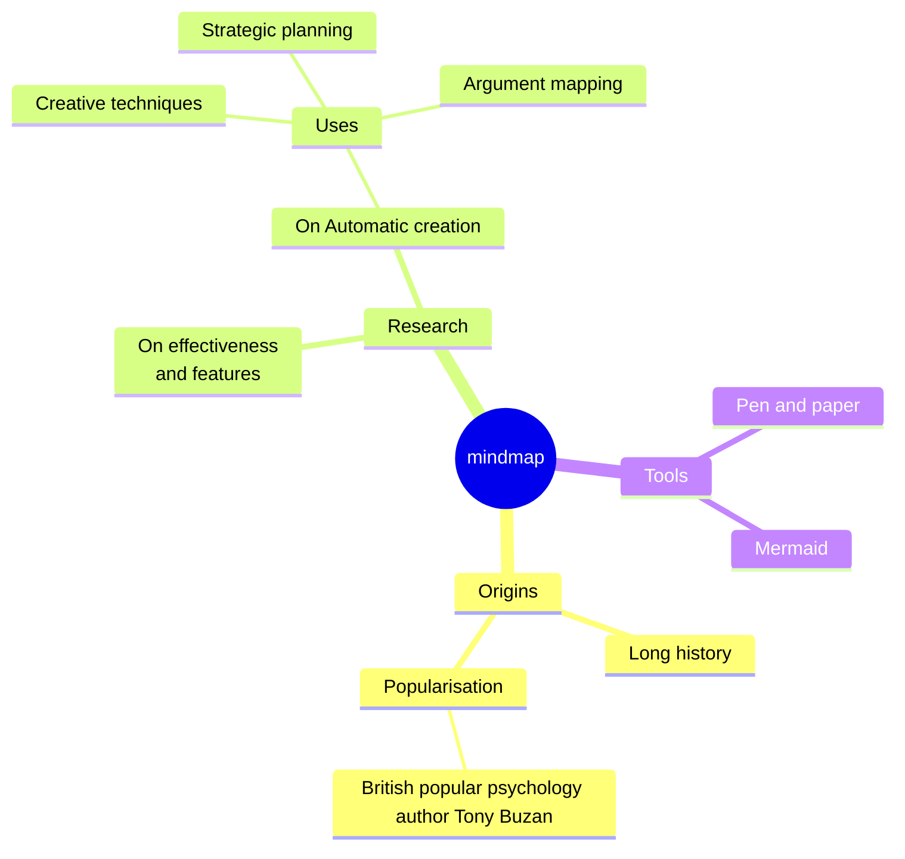
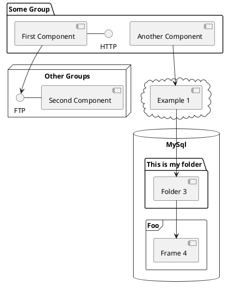

---
# try also 'default' to start simple
theme: default
# random image from a curated Unsplash collection by Anthony
# like them? see https://unsplash.com/collections/94734566/slidev
background: p&id_epr.png
# some information about your slides, markdown enabled
title: Ada Community Advocacy
info: |
  ## Ada Community Advocacy
  Fostering a healthy ecosystem for the future of Ada

# apply any unocss classes to the current slide
class: text-center
# https://sli.dev/custom/highlighters.html
highlighter: shiki
# https://sli.dev/guide/drawing
drawings:
  persist: false
# slide transition: https://sli.dev/guide/animations#slide-transitions
transition: slide-left
# enable MDC Syntax: https://sli.dev/guide/syntax#mdc-syntax
mdc: true
---

# Ada Community Advocacy

### Fostering a healthy ecosystem for the future of Ada

Fernando Oleo Blanco - Irvise

---
transition: fade-out
---

# Contents

What to expect

- Introduce myself

- Difference between formal & organised community and the _Outer Wilds_

- _Bob Dylan - The Times They Are A-Changin'_

- Being efficient, fosterin and selling Ada

- Future? Hopefully a bright one!

## Community discussion, **feel free to participate & interrupt!**

The presentation style is going to be *very* informal

---
layout: image-right
image: https://irvise.xyz/main-profile-cropped.jpg
---

# `whoami`

- Fer, the original since 1997 :)
   - Irvise in the net
- Industrial and mechanical engineer
   - Materials, thermals, fluids
- Currently working in the nuclear sector
   - System designer (P&IDs, cycles, components...), no programming!
- Huge [Libre Software](https://www.gnu.org/philosophy/free-sw.en.html) aficionado
   - Full-time Linux since 18
- And what about Ada?
  - Hopefully my point of view enhances yours

---
layout: two-cols
layouClass: gap-16
---

# Programming history

- `Hello World!` in Ruby at... 16?
- Functions, loops, ifs and Fibonacci in Python 3
- University, bachellor
  - C (for embedded systems)
  - Matlab
  - Operational Research...
  - ???
- Industrial Eng. Master
  - Function Blocks, Structured Text, Sequential Function Charts, Ladder (PLC)
  
::right::

<v-click>

# Fortran 66

[FRAPTRAN-2.0](https://fast.labworks.org/), nuclear safety analysis (LOCA)

Very well written, documented, commented and structured.

```f77
      COMMON A/B
C     COMMENT
      X=KODE(J)
      IF (X.LT.0) GO TO 55
      IF (X.EQ.0) GO TO 55
      GO TO 40

55    CALL SOMETHING(INTPUT, OUTFLOAT)
```
</v-click>

<v-click>
<br>
We can do better!
</v-click>

<v-click>

- **Fortran 2003-2023**
- C/C++?
- [Frama-C](https://frama-c.com/), [seL4](https://sel4.systems/)?

[*Real Programmers Don't Use PASCAL*](https://homepages.inf.ed.ac.uk/rni/papers/realprg.html)

</v-click>

---
layout: two-cols
layoutClass: gap-16
---


<div v-click.hide="3">

# Enter... Ada

- "Formally verified with [SPARK](https://learn.adacore.com/courses/intro-to-spark/index.html)"
- "Readable and easy to learn"
- "Efficient, low level, compiled and without GC"
- "Used in the army, aeronautical and space"
- ...

<div v-click="[1, 3]">

## 🤔🧐
```ada
with Ada.Text_IO;

procedure My_Hello_World is
begin
   Ada.Text_IO.Put_Line ("Hello, World!");
end My_Hello_World;
```

Mmmm...

</div>
</div>

<div v-click="3" class="absolute left-30px top-10px">


</div>

::right::

<div v-click="2">

```ada
-- 18.3 Memory Map
type UART_Type is record
   txdata : txdata_Type with Volatile_Full_Access => True;
   rxdata : rxdata_Type with Volatile_Full_Access => True;
   txctrl : txctrl_Type with Volatile_Full_Access => True;
   rxctrl : rxctrl_Type with Volatile_Full_Access => True;
   ie     : ie_Type     with Volatile_Full_Access => True;
   ip     : ip_Type     with Volatile_Full_Access => True;
   div    : div_Type    with Volatile_Full_Access => True;
end record
   with Size => 7 * 32;
for UART_Type use record
   txdata at 16#00# range 0 .. 31;
   rxdata at 16#04# range 0 .. 31;
   txctrl at 16#08# range 0 .. 31;
   rxctrl at 16#0C# range 0 .. 31;
   ie     at 16#10# range 0 .. 31;
   ip     at 16#14# range 0 .. 31;
   div    at 16#18# range 0 .. 31;
end record;
UART0_BASEADDRESS : constant := 16#1001_3000#;
UART0 : aliased UART_Type
   with Address    => System'To_Address (UART0_BASEADDRESS),
        Volatile   => True,
        Import     => True,
        Convention => Ada;
```

</div>

---
---

# My beginning

<Youtube id="YPD9U4Wuh5A" width="875" height="430"/>

---
transition: fade-out
---

# Continuation

1. Started using [AVRAda](https://github.com/RREE/AVRAda_Examples) and gave some feedback
2. Ada and RISC-V? Lets goooo [HiFive Rev B](https://www.sifive.com/boards/hifive1-rev-b)
   1. Helped get the Rev B up and running in [`Ada_Drivers_Library`](https://github.com/AdaCore/Ada_Drivers_Library/commit/c958bb1d7fdf941b14b96eea61a78edb77216a10)
3. [NetBSD](http://netbsd.org/) runs everywhere... and so does Ada...
   1. With the huge help of [J. Marino](http://www.ravenports.com/), updated [GNAT 10](https://cdn.netbsd.org/pub/pkgsrc/current/pkgsrc/lang/gcc10-aux/index.html) in [pkgsrc](https://www.pkgsrc.org/)
4. [Dirk Craynest](https://archive.fosdem.org/2020/schedule/speaker/dirk_craeynest/) was stepping down from organising the Ada Devroom @ FOSDEM 
   1. No body stood up for 2022, so I did
      1. I really liked the Ada videos in FOSDEM, specially [J-P's Introduction to Ada](https://archive.fosdem.org/2018/schedule/event/ada_introduction/)
      2. I did not want it to die...
   2. (Virtual) Room in 2022
   3. Stand in 2023
   4. Nothing in 2024...
5. Ada was dying... something had to be done... [Ada Monthly Meeting](https://forum.ada-lang.io/t/ada-monthly-meeting/384)

---
layout: center
class: text-center
---

# Focus on informal & amateur communities

---
layout: two-cols
layoutClass: gap-16
---

# Table of contents

You can use the `Toc` component to generate a table of contents for your slides:

```html
<Toc minDepth="1" maxDepth="1"></Toc>
```

The title will be inferred from your slide content, or you can override it with `title` and `level` in your frontmatter.

::right::

<Toc v-click minDepth="1" maxDepth="2"></Toc>

---
layout: image-right
image: https://cover.sli.dev
---

# Code

Use code snippets and get the highlighting directly, and even types hover![^1]

```ts {all|5|7|7-8|10|all} twoslash
// TwoSlash enables TypeScript hover information
// and errors in markdown code blocks
// More at https://shiki.style/packages/twoslash

import { computed, ref } from 'vue'

const count = ref(0)
const doubled = computed(() => count.value * 2)

doubled.value = 2
```

<arrow v-click="[4, 5]" x1="350" y1="310" x2="195" y2="334" color="#953" width="2" arrowSize="1" />

<!-- This allow you to embed external code blocks -->
<!-- Footer -->
[^1]: [Learn More](https://sli.dev/guide/syntax.html#line-highlighting)

<!-- Inline style -->
<style>
.footnotes-sep {
  @apply mt-5 opacity-10;
}
.footnotes {
  @apply text-sm opacity-75;
}
.footnote-backref {
  display: none;
}
</style>

<!--
Notes can also sync with clicks

[click] This will be highlighted after the first click

[click] Highlighted with `count = ref(0)`

[click:3] Last click (skip two clicks)
-->

---
level: 2
---

# Shiki Magic Move

Powered by [shiki-magic-move](https://shiki-magic-move.netlify.app/), Slidev supports animations across multiple code snippets.

Add multiple code blocks and wrap them with <code>````md magic-move</code> (four backticks) to enable the magic move. For example:

````md magic-move {lines: true}
```ts {*|2|*}
// step 1
const author = reactive({
  name: 'John Doe',
  books: [
    'Vue 2 - Advanced Guide',
    'Vue 3 - Basic Guide',
    'Vue 4 - The Mystery'
  ]
})
```

```ts {*|1-2|3-4|3-4,8}
// step 2
export default {
  data() {
    return {
      author: {
        name: 'John Doe',
        books: [
          'Vue 2 - Advanced Guide',
          'Vue 3 - Basic Guide',
          'Vue 4 - The Mystery'
        ]
      }
    }
  }
}
```

```ts
// step 3
export default {
  data: () => ({
    author: {
      name: 'John Doe',
      books: [
        'Vue 2 - Advanced Guide',
        'Vue 3 - Basic Guide',
        'Vue 4 - The Mystery'
      ]
    }
  })
}
```

Non-code blocks are ignored.

```vue
<!-- step 4 -->
<script setup>
const author = {
  name: 'John Doe',
  books: [
    'Vue 2 - Advanced Guide',
    'Vue 3 - Basic Guide',
    'Vue 4 - The Mystery'
  ]
}
</script>
```
````

---

# Components

<div grid="~ cols-2 gap-4">
<div>

You can use Vue components directly inside your slides.

We have provided a few built-in components like `<Tweet/>` and `<Youtube/>` that you can use directly. And adding your custom components is also super easy.

```html
<Counter :count="10" />
```

<!-- ./components/Counter.vue -->
<Counter :count="10" m="t-4" />

Check out [the guides](https://sli.dev/builtin/components.html) for more.

</div>
<div>

```html
<Tweet id="1390115482657726468" />
```

<Tweet id="1390115482657726468" scale="0.65" />

</div>
</div>

<!--
Presenter note with **bold**, *italic*, and ~~striked~~ text.

Also, HTML elements are valid:
<div class="flex w-full">
  <span style="flex-grow: 1;">Left content</span>
  <span>Right content</span>
</div>
-->

---
class: px-20
---

# Themes

Slidev comes with powerful theming support. Themes can provide styles, layouts, components, or even configurations for tools. Switching between themes by just **one edit** in your frontmatter:

<div grid="~ cols-2 gap-2" m="t-2">

```yaml
---
theme: default
---
```

```yaml
---
theme: seriph
---
```


</div>

Read more about [How to use a theme](https://sli.dev/themes/use.html) and
check out the [Awesome Themes Gallery](https://sli.dev/themes/gallery.html).

---

# Clicks Animations

You can add `v-click` to elements to add a click animation.

<div v-click>

This shows up when you click the slide:

```html
<div v-click>This shows up when you click the slide.</div>
```

</div>

<br>

<v-click>

The <span v-mark.red="3"><code>v-mark</code> directive</span>
also allows you to add
<span v-mark.circle.orange="4">inline marks</span>
, powered by [Rough Notation](https://roughnotation.com/):

```html
<span v-mark.underline.orange>inline markers</span>
```

</v-click>

<div mt-20 v-click>

[Learn More](https://sli.dev/guide/animations#click-animations)

</div>

---

# Motions

Motion animations are powered by [@vueuse/motion](https://motion.vueuse.org/), triggered by `v-motion` directive.

```html
<div
  v-motion
  :initial="{ x: -80 }"
  :enter="{ x: 0 }"
  :click-3="{ x: 80 }"
  :leave="{ x: 1000 }"
>
  Slidev
</div>
```

<div class="w-60 relative">
  <div class="relative w-40 h-40">
    
    
    
  </div>

  <div
    class="text-5xl absolute top-14 left-40 text-[#2B90B6] -z-1"
    v-motion
    :initial="{ x: -80, opacity: 0}"
    :enter="{ x: 0, opacity: 1, transition: { delay: 2000, duration: 1000 } }">
    Slidev
  </div>
</div>

<!-- vue script setup scripts can be directly used in markdown, and will only affects current page -->
<script setup lang="ts">
const final = {
  x: 0,
  y: 0,
  rotate: 0,
  scale: 1,
  transition: {
    type: 'spring',
    damping: 10,
    stiffness: 20,
    mass: 2
  }
}
</script>

<div
  v-motion
  :initial="{ x:35, y: 30, opacity: 0}"
  :enter="{ y: 0, opacity: 1, transition: { delay: 3500 } }">

[Learn More](https://sli.dev/guide/animations.html#motion)

</div>

---

# LaTeX

LaTeX is supported out-of-box powered by [KaTeX](https://katex.org/).

<br>

Inline $\sqrt{3x-1}+(1+x)^2$

Block
$$ {1|3|all}
\begin{array}{c}

\nabla \times \vec{\mathbf{B}} -\, \frac1c\, \frac{\partial\vec{\mathbf{E}}}{\partial t} &
= \frac{4\pi}{c}\vec{\mathbf{j}}    \nabla \cdot \vec{\mathbf{E}} & = 4 \pi \rho \\

\nabla \times \vec{\mathbf{E}}\, +\, \frac1c\, \frac{\partial\vec{\mathbf{B}}}{\partial t} & = \vec{\mathbf{0}} \\

\nabla \cdot \vec{\mathbf{B}} & = 0

\end{array}
$$

<br>

[Learn more](https://sli.dev/guide/syntax#latex)

---

# Diagrams

You can create diagrams / graphs from textual descriptions, directly in your Markdown.

<div class="grid grid-cols-4 gap-5 pt-4 -mb-6">









</div>

[Learn More](https://sli.dev/guide/syntax.html#diagrams)

---
foo: bar
dragPos:
  square: 691,32,167,_,-16
---

# Draggable Elements

Double-click on the draggable elements to edit their positions.

<br>

###### Directive Usage

```md

```

<br>

###### Component Usage

```md
<v-drag text-3xl>
  <carbon:arrow-up />
  Use the `v-drag` component to have a draggable container!
</v-drag>
```

<v-drag pos="663,206,261,_,-15">
  <div text-center text-3xl border border-main rounded>
    Double-click me!
  </div>
</v-drag>


###### Draggable Arrow

```md
<v-drag-arrow two-way />
```

<v-drag-arrow pos="67,452,253,46" two-way op70 />

---

# Monaco Editor

Slidev provides built-in Monaco Editor support.

Add `{monaco}` to the code block to turn it into an editor:

```ts {monaco}
import { ref } from 'vue'
import { emptyArray } from './external'

const arr = ref(emptyArray(10))
```

Use `{monaco-run}` to create an editor that can execute the code directly in the slide:

```ts {monaco-run}
import { version } from 'vue'
import { emptyArray, sayHello } from './external'

sayHello()
console.log(`vue ${version}`)
console.log(emptyArray<number>(10).reduce(fib => [...fib, fib.at(-1)! + fib.at(-2)!], [1, 1]))
```

---
layout: center
class: text-center
---

# Learn More

[Documentations](https://sli.dev) · [GitHub](https://github.com/slidevjs/slidev) · [Showcases](https://sli.dev/showcases.html)
